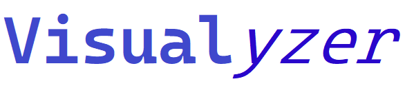
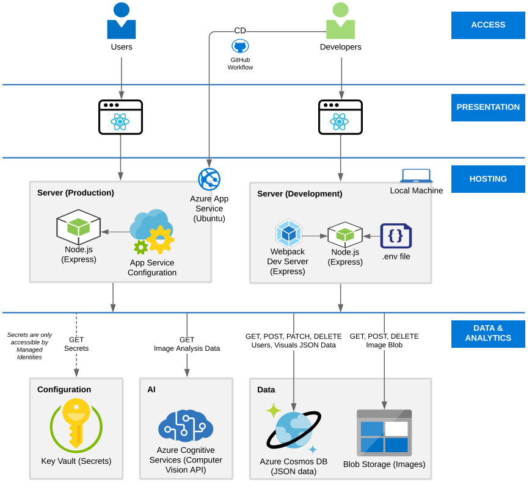

 

**Visual<sub>yzer</sub>** is an application that will analyze your visuals and give insights by identifying famous landmarks and people. It will also try to identify visual features involved in the image such as animals, buildings, drinks, food, indoor, outdoor, people, plants, sky, etc.

# Contents

- [How it works](#how-it-works)
  - [Technologies](#technologies)
  - [Architecture](#architecture)
  - [Image requirements](#image-requirements)
- [Installation](#installation)
  - [Prerequisites](#prerequisites)
  - [Project structure](#project-structure)
  - [Create RSA key pair](#create-rsa-key-pair)
  - [Azure resources](#azure-resources)
  - [API (Node.js) project](#api-nodejs-project)
  - [Web (React) project](#web-react-project)
- [Disclaimer](#disclaimer)
- [References](#references)

## How it works

Visualyzer allows registered users to upload their visuals for analysis. It uses [Microsoft Azure Cognitive Services - Computer Vision](https://docs.microsoft.com/en-gb/azure/cognitive-services/computer-vision/) to analyze these visuals. Key features:

- No need to register to view visuals that are made public by registered users.
- Option to register and store your visuals indefinitely or delete them when not required.
- Ability to agree / disagree on the anlaysis results.
- Interact with other users using the comment section under the visual.

### Technologies

The application uses three main technologies:

- **React**: the internet facing SPA.
- **Node.js**: the API application that serves the SPA. It consists of two resources - users and visuals.
- **Azure**: hosts the application, database, files, and analyze the images.

### Architecture

The below diagram shows the technical architecture.



### Image requirements

- The image must be presented in JPEG, PNG, GIF, or BMP format
- The file size of the image must be less than 4 megabytes (MB)
- The dimensions of the image must be greater than 50 x 50 pixels

## Installation

Please follow the step-by-step instructions below to setup your development environment.

### Prerequisites

1. Azure subscription
1. [Azure CLI](https://docs.microsoft.com/en-us/cli/azure/install-azure-cli)
1. Node.js
1. VS Code or any other IDE

### Project structure

The application is organized into the following folder structure:

    .
    ├── .github                 # Contains the github workflows and templates
    ├── docs                    # General documentation
    ├── src                     # The application code base
    │   ├── api                 # The Node.js application code base
    │   ├── operations          # The IaC code
    │   ├── web                 # The React application
    └── ...

### Create RSA key pair

1. Create a RSA256 (Private and Public RSA Key pair) for JWT tokens using the following commands.

   ```bash
   ssh-keygen -t rsa -b 4096 -m PEM -f jwtRS256.key
   # Don't add passphrase
   openssl rsa -in jwtRS256.key -pubout -outform PEM -out jwtRS256.key.pub
   ```

### Azure resources

1. :open_file_folder: Navigate to `src/operations/bicep` directory.
1. Run `az login` in a shell (PowerShell/Bash) to login to your Azure subscription.
1. Run `./provision.sh` by supplying values to the following three variables in order to create the resources.

- `APP_NAME` - The name of the application. It will be used as prefix for resource names. For example, `visualyzer`.
- `LOCATION_NAME` - The name of the Azure location where you would like to have your resoures provisioned. For example, `westus2`.  
  :pushpin: Use the command `az account list-locations -o table` to find all the locations that are supported.
- `PRINCIPAL_ID` - The object ID of the Azure AD user or (ideally) group who will be assigned permissions to read, write, delete secrets in Azure Key Vault (which are essentially Get, List, Set, Delete secret management operations).
- `JWT_PRIVATE_KEY_VALUE` - The RSA private key vaule with newlines replaced with `\n`
- `JWT_PUBLIC_KEY_VALUE` - The RSA public key vaule with newlines replaced with `\n`

Example script to use in Bash shell:

```bash
export APP_NAME=visualyzer
export LOCATION_NAME=<westus2|other region>
export PRINCIPAL_ID=<PASTE_PRINCIPAL_ID_HERE>
export JWT_PRIVATE_KEY_VALUE='<PASTE_THE_PRIVATE_KEY_VALUE>'
export JWT_PUBLIC_KEY_VALUE='<PASTE_THE_PUBLIC_KEY_VALUE>'
./provision.sh
```

### API (Node.js) project

1. :open_file_folder: Navigate to `src/api` directory.

1. Create an `.env` file in the folder by suppling values to the following variables. Replace `<...>` with appropriate values.

   ```env
   AZURE_COMPUTER_VISION_API_ANALYZE_ENDPOINT=https://<LOCATION_NAME>.api.cognitive.microsoft.com/vision/v3.2/analyze
   JWT_PRIVATE_KEY_VALUE=<PASTE_THE_JWT_PRIVATE_KEY_VALUE_AFTER_REPLACING_NEWLINES_WITH_\n>
   JWT_PUBLIC_KEY_VALUE=<PASTE_THE_JWT_PUBLIC_KEY_VALUE_AFTER_REPLACING_NEWLINES_WITH_\n>
   JWT_VALIDITY_IN_SECONDS=3600
   KEY_VAULT_NAME=<APP_NAME>-kv
   STORAGE_ACCOUNT_HOST=<APP_NAME>stracc.blob.core.windows.net
   ```

   You can also find the Computer Vision API endpoint to be provided to `COMPUTER_VISION_API_ANALYZE_ENDPOINT` from the API documentation [here](https://westus.dev.cognitive.microsoft.com/docs/services/computer-vision-v3-2/) by selecting the region you supplied while creating the Azure resources.

   `JWT_VALIDITY_IN_SECONDS` variable is not mandatory, it defaults to 3600 seconds if not provided.

   Use the `.env.example` file as the template.

1. Run `npm i` to install the dependencies.
1. Run `npm run start:dev` to start the express.js server listening at port `3000`.
1. Run the API using `curl` or `postman`. For example, use `curl -v http://localhost:3000/api/visuals ` to get all public visuals.
1. :bell: Remove the `jwtRS256.key` and `jwtRS256.key.pub` files that were created as part of the JWT key generation step.

### Web (React) project

1. :open_file_folder: Navigate to `src/web` directory.
1. Run `npm i` to install the dependencies.
1. Run `npm run start:dev` to start the webpack development server listening at port `8080`. Browser will be opened by default and it will reload on changes.
1. Create a user by navigating to `http://localhost:8080/register`.
1. After registration is successful, upload images either by using public URL or from your local machine to analyze them.

## Disclaimer

According to Microsoft, they do not store your uploaded images or videos after they are analyzed:

> Microsoft automatically deletes your images and videos after processing and doesn’t train on your data to enhance the underlying models. Video data doesn’t leave your premises, and video data isn’t stored on the edge where the container runs.

Please read their privacy policy [here](https://azure.microsoft.com/en-gb/support/legal/cognitive-services-compliance-and-privacy/).

## References

### Node.js

- [Express and Node.js app deployment](https://developer.mozilla.org/en-US/docs/Learn/Server-side/Express_Nodejs/deployment)

### React

- [React Patterns](https://javascript.plainenglish.io/5-advanced-react-patterns-a6b7624267a6)

### Azure with Node.js

- [Azure Cosmos with Nodejs](https://docs.microsoft.com/en-us/azure/cosmos-db/sql-api-nodejs-application)
- [Handling Authentication in NodeJS](https://codeburst.io/handling-authentication-in-nodejs-express-with-passport-part-3-authentication-and-authorization-8e07d819a113)
- [Upload images to container](https://docs.microsoft.com/en-us/azure/storage/blobs/storage-quickstart-blobs-nodejs#upload-blobs-to-a-container)
- [Upload images to Azure blob storage](https://arjunphp.com/express-js-upload-images-to-azure-blob-storage/)

### Source Control

- [GitHub emojis](https://github.com/ikatyang/emoji-cheat-sheet/blob/master/README.md)
- [Awesome README's](https://github.com/matiassingers/awesome-readme)

### Books and articles

- [Functional programming in JavaScript](https://www.manning.com/books/functional-programming-in-javascript)
- [You Don't Know JS Yet](https://github.com/getify/You-Dont-Know-JS)
- [Practical modern JavaScript](https://github.com/mjavascript/practical-modern-javascript)
